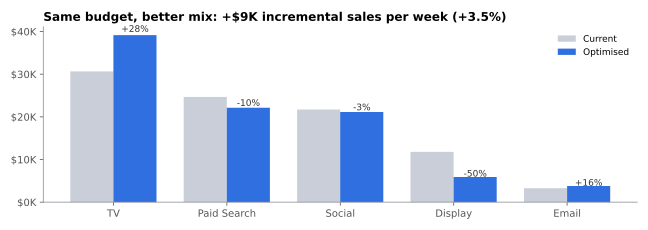
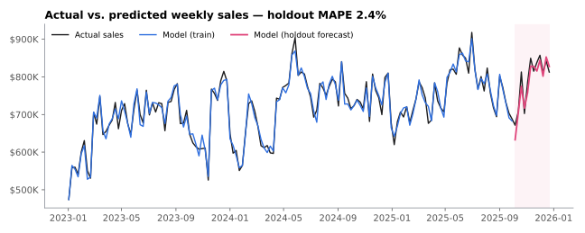
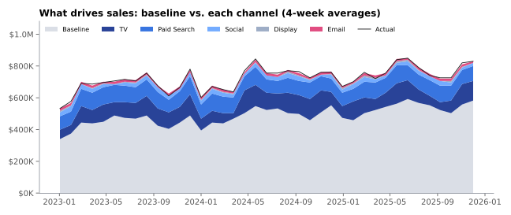
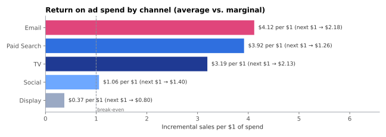
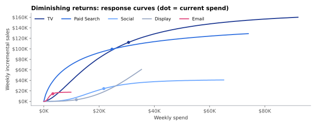

# Marketing Mix Modeling — Where Should the Next Ad Dollar Go?

A from-scratch **Marketing Mix Model (MMM)** that answers the question every CMO asks:
*which channels actually drive sales, and how should we split next quarter's budget?*

It models three years of weekly data for a direct-to-consumer brand across **TV, Paid Search, Social, Display and Email**,
separates true advertising impact from baseline demand (trend, seasonality, pricing, promotions, holidays),
and then re-allocates the same budget to sell more.



## Key results

| | |
|---|---|
| **Model fit** | R² 0.97 on training data · **2.4% MAPE on a 12-week holdout** the model never saw |
| **Media impact** | Advertising drives **~33% of sales**; the rest is baseline demand |
| **Best returns** | Email ($4.12 per $1), Paid Search ($3.92) and TV ($3.19) |
| **Weakest channel** | Display returns **$0.37 per $1** — below break-even |
| **Recommendation** | Shift spend from Display and Search into TV and Email: **+$8.9K incremental sales per week (≈ +$460K a year) at the same budget** |
| **Validated** | Against the simulator's ground truth, the new plan really does add **+$7.2K/week (≈ +$376K/year)** |

## How it works

```
sales_t = baseline_t + Σ_channels  β_c · Hill( Adstock(spend_c,t ; decay_c) ; k_c , s_c ) + ε
```

1. **Adstock (carry-over).** Advertising keeps working after the week it runs. A geometric adstock carries a share
   `decay` of last week's effect forward — TV's effect lingers for weeks, Search's is almost immediate.
2. **Hill saturation (diminishing returns).** The first $10K in a channel buys more than the next $10K.
   A Hill curve with half-saturation point `k` and shape `s` captures this.
3. **Baseline.** Intercept, growth trend, annual seasonality (sine/cosine), price index, promotions and holiday weeks.
4. **Fitting — variable projection.** A global optimiser (differential evolution) searches the non-linear media
   parameters; for every candidate the linear coefficients are solved exactly with **non-negative least squares**,
   so no channel can have a negative effect on sales.
5. **Budget optimiser.** Using each channel's fitted response curve, SLSQP re-allocates a fixed weekly budget
   (each channel limited to 0.5×–2× its current spend) to maximise incremental sales.

## Charts

**Does the model predict sales it hasn't seen?** The shaded area is the 12-week holdout.


**What drives sales** — baseline demand vs. each channel's incremental contribution (4-week averages).


**Return on ad spend.** Average ROI shows what a channel has earned; marginal ROI shows what the *next* dollar earns —
the number that should drive budget decisions.


**Diminishing returns.** Dots mark current weekly spend. Where a curve has flattened, extra money is wasted.


## Honest validation: model vs. ground truth

Real spend and sales data is confidential, so this project uses a **synthetic dataset with known "true" parameters**
(`data/generate_data.py`). That makes it possible to check what most MMMs never can — whether the model recovers reality.

| Channel | Estimated ROI | True ROI | Estimated decay | True decay |
|---|---|---|---|---|
| TV | 3.19 | 2.86 | 0.59 | 0.60 |
| Paid Search | 3.92 | 2.31 | 0.03 | 0.10 |
| Social | 1.06 | 1.70 | 0.14 | 0.35 |
| Display | 0.37 | 0.96 | 0.00 | 0.30 |
| Email | 4.12 | 6.66 | 0.02 | 0.20 |

**What this shows:**
- The model gets the **big picture right**: TV's long carry-over (0.59 vs 0.60), which channels are strong vs. weak,
  total media share (33% vs 30% true), and a budget shift that genuinely increases sales.
- Individual ROIs can be off — Paid Search is **over-credited** because its spend moves with overall demand, a
  well-known MMM identification problem. In practice this is fixed with **geo-experiments or lift tests** to calibrate
  the model, or Bayesian priors (e.g. Meridian, PyMC-Marketing).

## Repository structure

```
├── data/
│   ├── generate_data.py      # synthetic weekly dataset with known ground truth
│   └── marketing_data.csv    # 156 weeks · 5 channels · price, promo, holiday
├── src/
│   ├── mmm.py                # adstock, Hill saturation, model fitting & decomposition
│   └── optimize_budget.py    # constrained budget re-allocation
├── outputs/                  # channel_summary.csv · budget_plan.csv · results.json
├── images/                   # charts used in this README
└── run_analysis.py           # end-to-end pipeline
```

## Run it

```bash
pip install -r requirements.txt
python data/generate_data.py   # optional: regenerate the dataset
python run_analysis.py         # fits the model (~2 min), writes outputs/ and images/
```

## Skills demonstrated

Marketing analytics · media mix modeling · non-linear optimisation · time-series feature engineering ·
model validation (holdout + ground-truth recovery) · budget optimisation · data storytelling

---
*Built by [Kush Vyas](https://kushvyas-personal-site.vercel.app) — MS Business Analytics, Boston University.*
